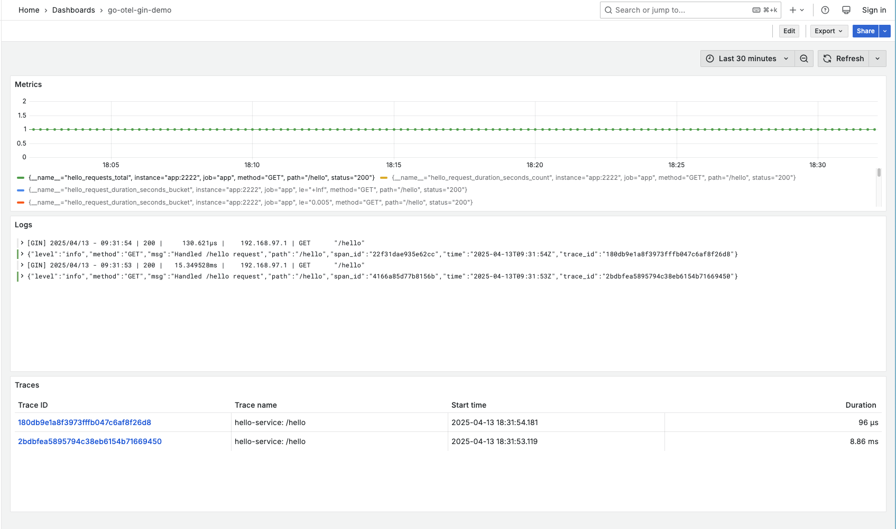

# Go OpenTelemetry with Gin Demo

This project demonstrates how to implement a complete observability stack for a Go Gin application using OpenTelemetry, Jaeger, Prometheus, Loki, and Grafana.

## Features

- Distributed tracing with OpenTelemetry and Jaeger
- Metrics collection with Prometheus
- Log aggregation with Loki
- Visualization with Grafana
- Complete docker-compose setup for local development
- Auto configurated Grafana datasource and dashboards
- Continuous integration with GitHub Actions

## Components

| Component | Description | URL |
| --- | --- | --- |
| Go Gin Application | Simple HTTP service instrumented with OpenTelemetry | [http://localhost:8080](http://localhost:8080) |
| Jaeger | Distributed tracing backend | [http://localhost:16686](http://localhost:16686) |
| Prometheus | Metrics collection and storage | [http://localhost:9090](http://localhost:9090) |
| Loki | Log aggregation system | [http://localhost:3100](http://localhost:3100) |
| Grafana | Visualization platform for metrics, logs, and traces | [http://localhost:3000](http://localhost:3000) |

## Quick Start

1. Clone this repository
2. Start all services:

```bash
docker-compose up -d
```

3. Generate some traffic:

```bash
curl http://localhost:8080/hello
```

4. Explore the observability stack:
   - View traces in Jaeger UI: [http://localhost:16686](http://localhost:16686)
   - View metrics in Prometheus: [http://localhost:9090](http://localhost:9090)
   - View everything in Grafana: [http://localhost:3000](http://localhost:3000)

## Grafana Dashboards

The project includes a pre-configured Grafana dashboard that shows:
- Request rates and latencies
- HTTP status code distribution
- Application logs with trace correlation
- Recent traces

Login to Grafana with:
- Username: admin
- Password: admin



## Application Structure

The Go application demonstrates:
- OpenTelemetry setup for distributed tracing
- Trace context propagation
- Metrics instrumentation
- JSON structured logging with trace IDs

## Testing

The application includes unit tests that test the actual implementation:

```bash
# Run all tests
go test ./...

# Run tests with verbose output
go test -v ./...

# Run a specific test
go test -run TestHelloEndpoint
```

The test suite includes:
- Tests for the actual router implementation from main.go
- Testing the /hello endpoint response
- Verification of error handling (404) for non-existent routes
- Integration with the OpenTelemetry tracing setup

Dependencies required for testing:
```
go get github.com/stretchr/testify/assert
```

## Continuous Integration

This project uses GitHub Actions for continuous integration. On each push or pull request to the main branch, the workflow:

1. Builds the application
2. Runs all unit tests

The workflow configuration is defined in `.github/workflows/test.yml`. To view the CI status, check the "Actions" tab in the GitHub repository.

## Modifying the Application

1. Edit `main.go` to change the application logic or add endpoints
2. Rebuild and restart the application:

```bash
docker-compose up -d --build app
```

## Troubleshooting

### Common Issues

- **DNS resolution issues**: Container names might not resolve properly. Check network configurations in docker-compose.yml.
- **Loki connection errors**: Verify Loki is running with `docker-compose ps loki` and check logs with `docker-compose logs loki`.
- **Missing data in Grafana**: Ensure your data sources are correctly configured and check time ranges.

### Useful Commands

Check container status:
```bash
docker-compose ps
```

View logs from a specific service:
```bash
docker-compose logs [service-name]
```

Restart a specific service:
```bash
docker-compose restart [service-name]
```

## Further Reading

- [OpenTelemetry Documentation](https://opentelemetry.io/docs/)
- [Jaeger Documentation](https://www.jaegertracing.io/docs/1.41/)
- [Loki Documentation](https://grafana.com/docs/loki/latest/)
- [Grafana Documentation](https://grafana.com/docs/grafana/latest/)